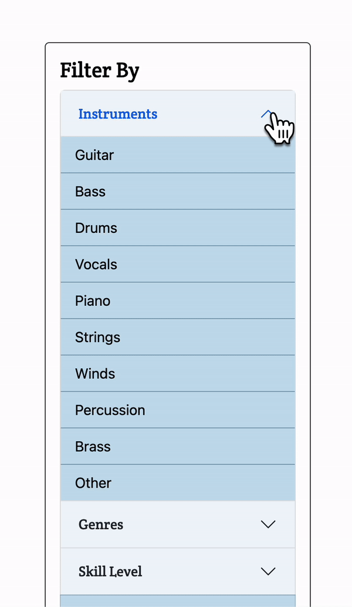

In my time designing web applications and just generally existing on the Internet, I've noticed that some design elements tend to recur across websites and reappear when designing websites. Navigation bars, search bars, and user authentication systems are very common components of web applications. Recurring elements like these, reusable concepts, and ideas constitute design patterns. While the method in which the component is implemented does not matter, the design pattern describes how the component looks and acts. For example, navigation bars can be created in different ways, but they all serve the same purpose in similar ways: allow easy navigation between pages of the website using links.

These recurring components also allow people to understand websites better for ease of use. After a user learns what a navigation bar is, what it looks like, and how to use it on one website, they can easily apply that knowledge for ease of use on other websites because the navigation bar is a very widespread design pattern and most websites have some form of navigation bar.
Some have recognized these design patterns and realized that they are staples in websites, so they have made them easy to create. Bootstrap and React, both web development frameworks, recognized that navigation bars, dropdowns, and forms are very common design patterns so it allows a developer to easily create those components without having to go through coding the styling and functionality for that component to work.


## Design Patterns in Practice
In one of my projects Mele Manoa, my team and I used a couple of different design patterns like a navigation bar, an authentication system, and a user profile. These features are all very common on web applications that run with a database of users. 

My personal favorite however is the sidebar, another common element in webpages. The sidebar that I've implemented in Mele Manoa filters what kind of information the user sees on the page with a simple list of toggleable buttons. I used React Bootstrap for this web application, and while React Bootstrap does not have a preset component for the sidebar that I wanted, it did have a preset list group, accordions, and toggleable buttons. I needed the accordion function because the list I needed in the sidebar was very long, but was split up into categories. I needed the list group because not every item in the list was in a category. With these three design patterns, I created the component that I wanted.
During its development, I also realized that the toggleable buttons that Bootstrap provided were not compatible with React Bootstrap's List Group. However, the toggleable buttons used a class to indicate their state, so I ditched the toggleable buttons but took the `active` class with me to create this sidebar. 

```
<h4>Filter By</h4>
<ListGroup>
  <ListGroup.Item className="p-0">
    <Accordion defaultActiveKey="0" flush>
      <Accordion.Item eventKey="0">
        <Accordion.Header>Genres</Accordion.Header>
        <Accordion.Body className="p-0">
          <ListGroup id="genre-group" variant="flush">
            {genres.map((genre, key) => (
              <ListGroup.Item
                action
                key={key}
                className="active"
                onClick={() => { changeGenreState(key); }}
              >
                {genre}
              </ListGroup.Item>
            ))}
          </ListGroup>
        </Accordion.Body>
      </Accordion.Item>
      <Accordion.Item eventKey="1">
        <Accordion.Header>Skill Level</Accordion.Header>
        <Accordion.Body className="p-0">
          <ListGroup id="skill-group" variant="flush">
            {skill.map((level, key) => (
              <ListGroup.Item
                action
                key={key}
                className="active"
                onClick={() => { changeSkillState(key); }}
              >
                {level}
              </ListGroup.Item>
            ))}
          </ListGroup>
        </Accordion.Body>
      </Accordion.Item>
    </Accordion>
  </ListGroup.Item>
  <ListGroup.Item
    id="seeking-item"
    action
    className="active"
    onClick={() => { changeSeekingState(); }}
  >
    Seeking Band Member
  </ListGroup.Item>
</ListGroup>
```
Knowing about design patterns ensures that your audience will know how to use your web application because the design patterns are so widespread and common. Many frameworks have also allowed them to be easily implementable and customizable, so what's not to use?
