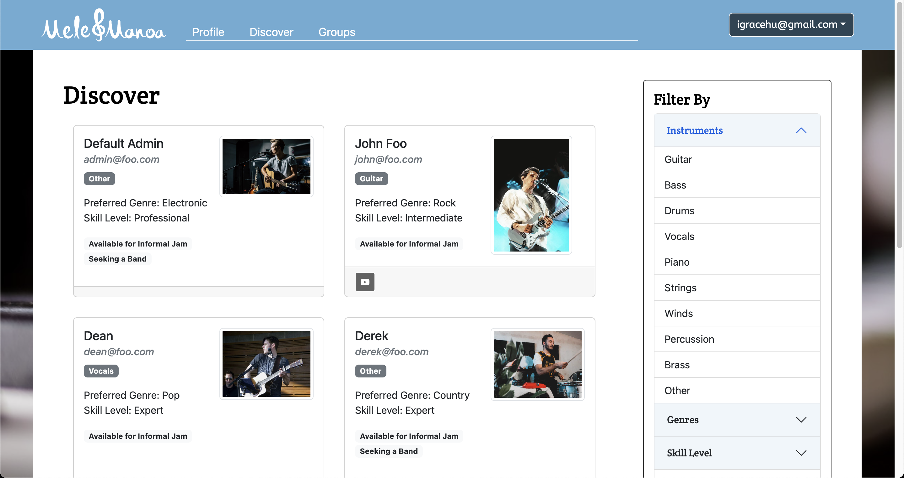

<figure class="figure float-end ps-4">
  
</figure>

Mele Manoa is a web application designed to bring musicians of UH together for jam sessions or performing bands. It is an easy way for them to find others with similar tastes and compatible musical abilities, by allowing students to create a profile indicating their musical tastes, their musical capabilities, and their musical goals. They can then find and connect with other musicians of similar interests using Mele Manoa and schedule informal jams or other kinds of meetups with new friends. Mele Manoa also allows musicaians to discover other musical groups to join or to enjoy.

[GitHub Page](https://mele-manoa.github.io/)