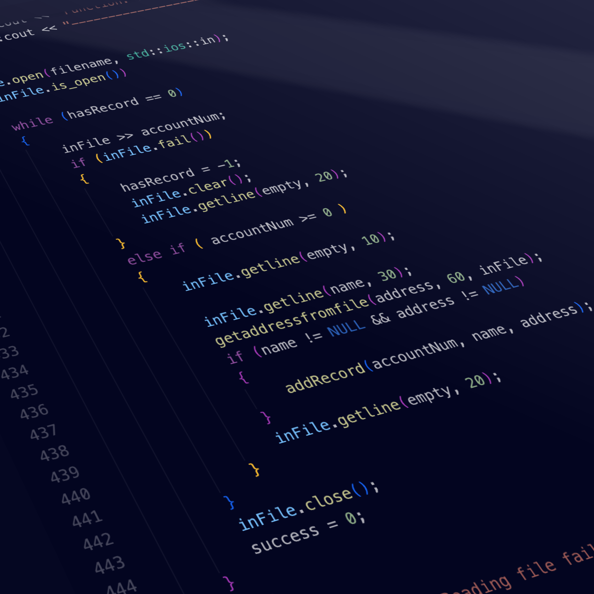

When I took ICS 212, we were to create a simulation of a user database using C++, the programming language we were learning at the time. The program could store, edit, find, and list the user information within the database. The information persists after the program is closed using file input/output. The program also included a debug mode that could be accessed from running the function in the command line. 

I learned and practiced the basics of C++ during this project, especially the specifics of how the input and output functions work and how they interact with the buffer.

This is the getaddress function that I wrote. Since addresses can be multi-line, I constructed a function that processes an input after a special character (in this case, ~) is typed in.

```cpp
void getaddress (char address[], int size)
{
    char currentChar;
    char* currentArray = address;
    char empty[5];
    
    #ifdef DEBUGMODE
        int i = 0;
        std::cout << "\x1b[93m" << "\n----------------------------------------------\n";
        std::cout << "DEBUG INFO" << std::endl;
        std::cout << "Function: getaddress" << std::endl;
        std::cout << "Parameters:" << std::endl;
        std::cout << "    char address[]:" << std::endl;
        std::cout << "      ";
        i = 0;
        while (address[i] != '\0')
        {
            std::cout << address[i];
            if (address[i] == '\n')
            {
                std::cout << "      ";
            }
            i++;
        }
        std::cout << std::endl;
        std::cout << "    int size: " << size << std::endl;
        std::cout << "----------------------------------------------\n" << "\x1b[0m";
    #endif

    std::cout << "Please enter your address." << std::endl;
    std::cout << "When you are finished typing, press ~ and hit enter." << std::endl;

    do
    /* Gets a character from the buffer into currentChar. Also 
    // stops if the current character is not ~ */
    {
        std::cin.get(currentChar);
        /* The character gets put into the current array position */
        *currentArray = currentChar;
        /* the current array position gets incremented */
        currentArray++;
    }
    while (--size > 0 && currentChar != '~');
    
    std::cin.clear();
    std::cin.getline(empty, 20);
    
    currentArray--;
    
    // Clears out the rest of the array in case previous address was long as heckums
    while (--size > 0) {
        *currentArray = '\0';
        currentArray++; 
    }

}
```

You can learn more at the [UH Micromouse News Announcement](https://manoa.hawaii.edu/news/article.php?aId=2857).
